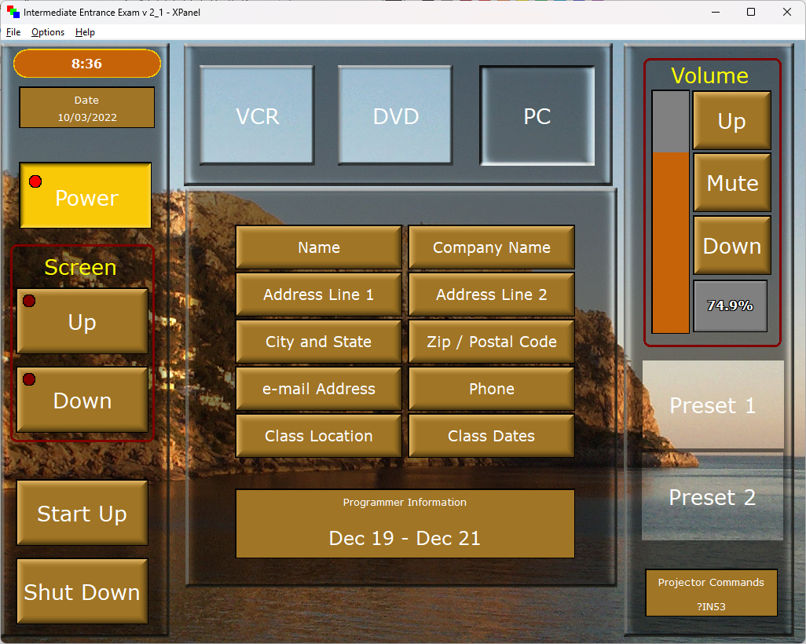

# P201 Intermediate Example

This folder contains code that drives the P201 Intermediate Exam XPanel.  I can't distribute the XPanel, but it looked like this:

There was a scope of work document that defined everything that needed to be done, but I've lost that.  I've recreated as much functionality as possible by looking at how my final SIMPL program worked.

## Blog Post

Following along step-by-step using my blog post here: https://kielthecoder.com/2022/10/22/p201-projector-exam/

## A Good Warm-Up

This is a very small program, so it likely serves as a good warm up for what's yet to come.  In the real world, I would just write this in SIMPL in a couple hours and call it done.  Recreating it in SIMPL# took about a day and a half.

## Old Technology

This program was notable to me because they used a pre-SmartGraphics XPanel for the test!  It's hard to remember a time now when VT Pro-e didn't include SmartGraphics, and now SG has become the outdated technology.

There are several password-protected modules that Crestron gave you for the test.  One of them handles the grading.  I took a peek inside of them and they hard-coded a bunch of the instructor's email addresses.  Presumably, if you filled in your class information correctly, the program would email the results to the same instructor you took the class with.

